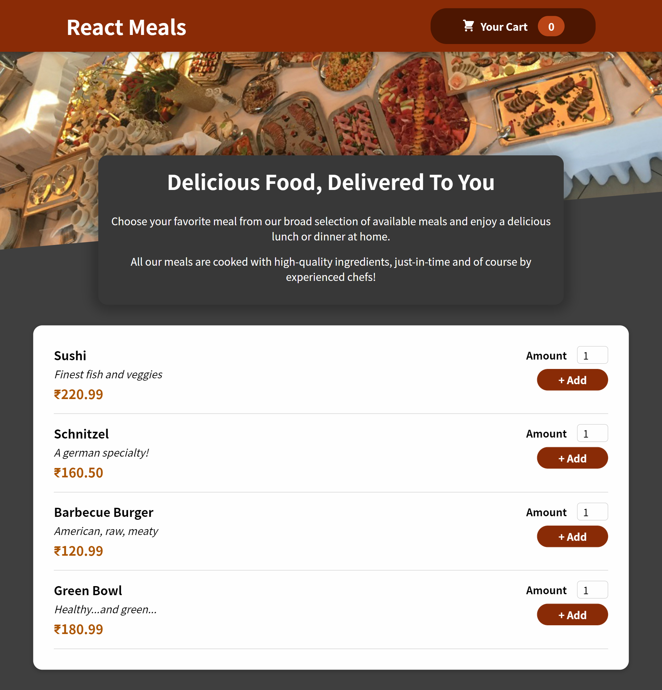

# Food Ordering App
Built in reactjs

<h1>[Getting Started]</h1>
    <h3>Execution</h3>
    
If you want to run our project in your local machine

    
Follow the given steps:

    <ul>
        <li>Clone our respository <a href="https://github.com/Suhani1102/food-ordering-app.git">https://github.com/Suhani1102/food-ordering-app.git</a></li>
        <li>Open our code in VS code</li>
        <li>On your terminal just write the command npm install</li>
        <li>Initialize the server by writing 'npm run server' on Terminal</li>
        <li>Than you can navigate to our website.</li>
    </ul>
        <h1>Built with</h1>
    <ul>
        <li>ReactJS</li>
    </ul>
